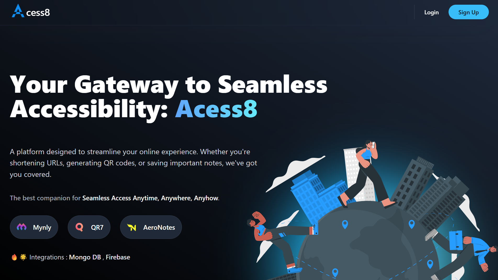
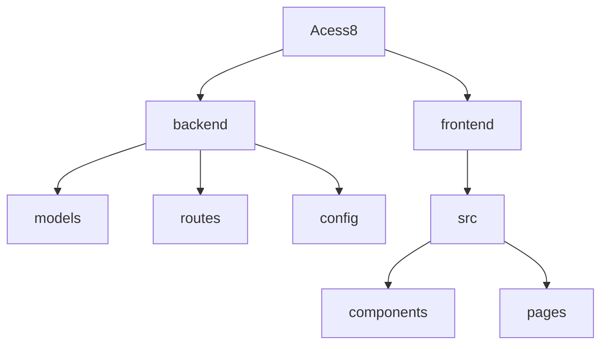

# Acess8: All-in-One Accessibility Platform

## 🗂️  Description

Acess8 is a comprehensive Accessibility platform designed to streamline your workflow and enhance your online presence. It offers a suite of tools, including a URL shortener, QR code generator, and secure note-taking features. This platform is ideal for individuals and businesses looking to manage their online activities efficiently.

## ✨ Key Features

### **Productivity Tools**
* **URL Shortener**: Shorten long URLs into manageable links, track click counts, and analyze performance.
* **QR Code Generator**: Create custom QR codes for URLs, share them easily, and track scan counts.
* **Secure Note-Taking**: Store sensitive information securely with end-to-end encryption and access controls.

### **User Management**
* **Authentication**: Secure login and signup processes with Google authentication and password reset features.
* **User Dashboard**: Personalized dashboard for accessing all tools, viewing analytics, and managing account settings.

### **Analytics and Insights**
* **Link Performance**: Track click counts, engagement metrics, and geographic data for shortened URLs.
* **QR Code Analytics**: Monitor scan counts, device types, and locations for generated QR codes.

## 🗂️ Folder Structure

## 🛠️ Tech Stack

## ⚙️ Setup Instructions

1. **Clone the repository**: `git clone https://github.com/subhadeeproy3902/Acess8.git`
2. **Navigate to the project directory**: `cd Acess8`
3. **Install dependencies**:
   * **Backend**: `cd backend && npm install`
   * **Frontend**: `cd frontend && npm install`
4. **Start the application**:
   * **Backend**: `npm run start`
   * **Frontend**: `npm run start`

## 🤝 Contributing

Contributions are welcome! If you'd like to contribute to Acess8, please fork the repository, create a new branch, and submit a pull request with your changes. Ensure that your contributions align with the project's coding standards and guidelines.

  

<h3>Subhadeep Roy</h3>

Full-stack developer with expertise in Next.js, AI, and Web3, running a web development agency and writing technical blogs.

    
